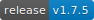
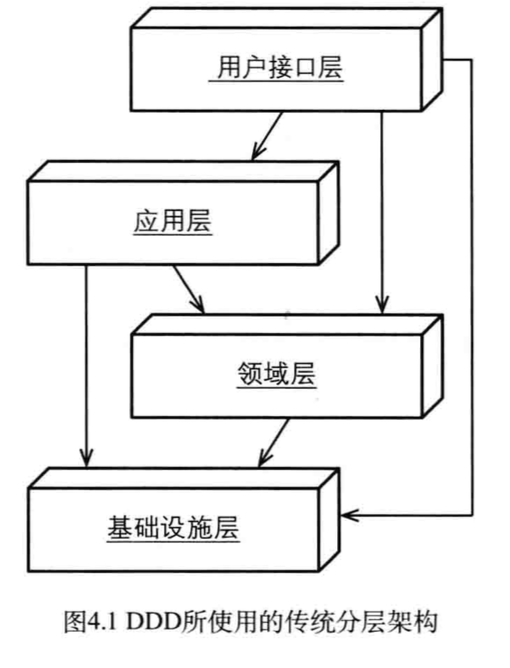

# Loxodon Framework

**MVVM Framework for Unity3D （C# & XLua）**

*开发者 Clark*

**要求Unity 5.6.0或者更高版本**

LoxodonFramework是一个轻量级的MVVM(Model-View-ViewModel)框架，它是专门为Unity3D游戏开发设计的，参考了WPF和Android的MVVM设计，它提供了视图和视图模型的数据绑定、本地化、一个简单的对象容器、配置文件组件、线程工具组件、应用上下文和玩家上下文，异步线程和协程的任务组件等基本组件，同时还提供了一个UI视图的框架。所有代码都基于面向对象面向接口的思路设计，几乎所有功能都可以自定义。而且在数据绑定部分进行了性能优化，在支持JIT的平台上使用的是委托的方式绑定，在不支持JIT的平台，默认使用的是反射，但是可以通过注入委托函数的方式来优化！

本框架使用C#语言开发，同时也支持使用XLua来开发，XLua插件是一个可选项，如果项目需要热更新，那么只要安装了XLua插件，则可以完全使用Lua来开发游戏。

这个插件兼容 MacOSX,Windows,Linux,UWP,IOS and Android等等，并且完全开源。

**已测试的平台：**  

- **PC/Mac/Linux**  (.Net2.0 subset; .Net2.0; .Net4.x; .Net Standard 2.0; IL2CPP)  
- **IOS**  (.Net2.0 subset; .Net2.0; .Net4.x; .Net Standard 2.0; IL2CPP)  
- **Android**  (.Net2.0 subset; .Net2.0; .Net4.x; .Net Standard 2.0; IL2CPP)  
- **UWP(window10)** (.Net2.0 subset; .Net2.0; .Net4.x; .Net Standard 2.0; IL2CPP)  

**关键特性**

- 支持多平台，高扩展性，面向接口开发; 
- 支持C#和Lua开发; 
- 支持线程和协程的异步结果和异步任务，采用Future/Promise设计模式; 
- 提供了多线程组件，线程切换组件和定时执行器; 
- 提供了一个消息系统，支持订阅和发布; 
- 提供可加密的配置文件，支持对象存取，可自定义类型转换器，扩展功能; 
- 提供了本地化支持，与Android的本地化类似，支持基本数据类型、数组、和U3D的一些值类型; 
- 支持全局上下文和玩家上下文; 
- 提供了一个服务容器，支持注册和注销服务; 
- 提供了AlertDialog、Loading、Toast等通用UI控件，支持自定义外观; 
- 提供了UI视图的控制和管理功能； 
- 提供数据绑定功能: 
    - Field绑定，只支持OneTime的模式，因无法支持改变通知; 
    - 属性绑定，支持TwoWay双向绑定，值修改自动通知; 
    - 普通字典、列表绑定，不支持改变通知; 
    - 支持C#事件绑定; 
    - 支持Unity3D的EventBase事件绑定; 
    - 支持静态类的属性和Field的绑定; 
    - 支持方法绑定（包括静态方法）; 
    - 支持命令绑定，通过命令绑定可以方便控制按钮的有效无效状态; 
    - 支持可观察属性、字典、列表的绑定，支持改变通知，视图模型修改自动更改UI显示; 
    - 支持表达式的绑定; 
    - 支持类型转换器，可以将图片名称转换为图集中的Sprite; 
    - 可以自定义扩展更多的绑定类型; 

## 下载 ##
Loxodon Framework 2017年1月份就已经在Unity3D资产商店发布，是一个收费的5星插件，在2017年底，我又为它做了XLua的扩展，支持完全使用Lua语言来开发游戏，中间有很长一段时间一直比较忙，就一直放在那，09年初我重新整理有关Lua的代码之后，准备在Github上开源，考虑到它只是Loxodon.Framework的一个插件，必须依赖Loxodon.Framework运行，所以就干脆把Loxodon.Framework也一并开源了，Unity3D官方商店也改成了免费项目，现在您可以在AssetStore和Github上都能下载到它。

- [Unity3d官方商店下载](https://www.assetstore.unity3d.com/#!/content/77446)
- [Github下载](https://github.com/cocowolf/loxodon-framework/releases)

## Lua插件安装（可选） ##

在本框架中，对于Lua语言的支持是通过插件扩展的方式来支持，它依赖腾讯的XLua项目和Loxodon.Framework.XLua插件，在项目的LoxodonFramework/Docs/XLua目录中可以找到Loxodon.Framework.XLua的插件，它是可选的，只有需要热更新并且使用Lua语言开发的项目才需要安装它。具体安装步骤如下，为避免出错，请严格按以下步骤安装。

### 安装XLua ###
从Xlua的Github仓库下载最新版的XLua，可以使用源码版本Source code.zip或者xlua_v2.x.xx.zip版本（建议使用xlua_v2.x.xx.zip版本，避免和XLua示例类名冲突）。请将下载好的xlua解压缩，拷贝到当前项目中。

[XLua下载](https://github.com/Tencent/xLua/releases "xlua")

### 配置宏定义 ###
配置Unity3D项目Player Setting/Other Settings/Scripting Define Symbols，添加XLUA的宏定义，为避免将来切换平台时出错，最好将PC、Android、iOS等平台的都配上。

### 导入Lua插件 ###
在LoxodonFramework/Docs/XLua/目录中，找到Loxodon.Framework.XLua.unitypackage文件，双击导入项目。

如果出现编译错误，请检查是否导入了XLua的Examples目录，这个目录下的InvokeLua.cs文件定义了PropertyChangedEventArgs类，因没有使用命名空间，会导致类名冲突，请删除XLua目录下的Examples文件夹或者给InvokeLua.cs文件中的PropertyChangedEventArgs类添加上命名空间。

### 查看示例 ###
打开LoxodonFramework/Lua/Examples目录，查看示例。

## 快速入门 ##

创建一个视图，左侧显示一个账号信息，右侧是一个表单，通过提交按钮可以修改左侧的账号信息，现在我们通过框架的视图和数据绑定功能来演示我们是如何做的。界面如下图：

### C# 示例 ###

在一个UI视图的根对象上添加视图脚本组件DatabindingExample，并且将UI控件赋值到对应的属性上,这个示例中属性都是通过C#硬编码来定义的，当然你也可以使用动态的属性表VariableArray来动态定义属性，具体可以看Lua的例子，配置好属性后如下图所示。

下面请看代码，我们是如果来定义视图模型和视图脚本的，又是怎么样来绑定视图到视图模型的。

    /// 

    /// 账号子视图模型
    /// 

	public class AccountViewModel : ObservableObject
    {
        private int id;
        private string username;
        private string password;
        private string email;
        private DateTime birthday;
        private readonly ObservableProperty<string> address = new ObservableProperty<string>();

        public int ID
        {
            get { return this.id; }
            set { this.Set<int>(ref this.id, value, "ID"); }
        }

        public string Username
        {
            get { return this.username; }
            set { this.Set<string>(ref this.username, value, "Username"); }
        }

        public string Password
        {
            get { return this.password; }
            set { this.Set<string>(ref this.password, value, "Password"); }
        }

        public string Email
        {
            get { return this.email; }
            set { this.Set<string>(ref this.email, value, "Email"); }
        }

        public DateTime Birthday
        {
            get { return this.birthday; }
            set { this.Set<DateTime>(ref this.birthday, value, "Birthday"); }
        }

        public ObservableProperty<string> Address
        {
            get { return this.address; }
        }
    }

    /// 

    /// 数据绑定示例的视图模型
    /// 

    public class DatabindingViewModel : ViewModelBase
    {
        private AccountViewModel account;
        private bool remember;
        private string username;
        private string email;
        private ObservableDictionary<string, string> errors = new ObservableDictionary<string, string>();

        public AccountViewModel Account
        {
            get { return this.account; }
            set { this.Set<AccountViewModel>(ref account, value, "Account"); }
        }

        public string Username
        {
            get { return this.username; }
            set { this.Set<string>(ref this.username, value, "Username"); }
        }

        public string Email
        {
            get { return this.email; }
            set { this.Set<string>(ref this.email, value, "Email"); }
        }

        public bool Remember
        {
            get { return this.remember; }
            set { this.Set<bool>(ref this.remember, value, "Remember"); }
        }

        public ObservableDictionary<string, string> Errors
        {
            get { return this.errors; }
            set { this.Set<ObservableDictionary<string, string>>(ref this.errors, value, "Errors"); }
        }

        public void OnUsernameValueChanged(string value)
        {
            Debug.LogFormat("Username ValueChanged:{0}", value);
        }

        public void OnEmailValueChanged(string value)
        {
            Debug.LogFormat("Email ValueChanged:{0}", value);
        }

        public void OnSubmit()
        {
            if (string.IsNullOrEmpty(this.Username) || !Regex.IsMatch(this.Username, "^[a-zA-Z0-9_-]{4,12}$"))
            {
                this.errors["errorMessage"] = "Please enter a valid username.";
                return;
            }

            if (string.IsNullOrEmpty(this.Email) || !Regex.IsMatch(this.Email, @"^\w+([-+.]\w+)*@\w+([-.]\w+)*\.\w+([-.]\w+)*$"))
            {
                this.errors["errorMessage"] = "Please enter a valid email.";
                return;
            }

            this.errors.Clear();
            this.Account.Username = this.Username;
            this.Account.Email = this.Email;
        }
    }

	/// 

    /// 数据绑定示例视图
    /// 

    public class DatabindingExample : UIView
    {
        public Text title;
        public Text username;
        public Text password;
        public Text email;
        public Text birthday;
        public Text address;
        public Text remember;

        public Text errorMessage;

        public InputField usernameEdit;
        public InputField emailEdit;
        public Toggle rememberEdit;
        public Button submit;

        protected override void Awake()
        {
			//获得应用上下文
            ApplicationContext context = Context.GetApplicationContext();

			//启动数据绑定服务
            BindingServiceBundle bindingService = new BindingServiceBundle(context.GetContainer());
            bindingService.Start();

			//初始化本地化服务
            CultureInfo cultureInfo = Locale.GetCultureInfo();
			var provider = new DefaultDataProvider("LocalizationTutorials", new XmlDocumentParser())
            Localization.Current = Localization.Create(provider, cultureInfo);

        }

        protected override void Start()
        {
			//创建账号子视图
            AccountViewModel account = new AccountViewModel()
            {
                ID = 1,
                Username = "test",
                Password = "test",
                Email = "yangpc.china@gmail.com",
                Birthday = new DateTime(2000, 3, 3)
            };
            account.Address.Value = "beijing";

			//创建数据绑定视图
            DatabindingViewModel databindingViewModel = new DatabindingViewModel()
            {
                Account = account
            };

			//获得数据绑定上下文
            IBindingContext bindingContext = this.BindingContext();

			//将视图模型赋值到DataContext
            bindingContext.DataContext = databindingViewModel;

            //绑定UI控件到视图模型
            BindingSet<DatabindingExample, DatabindingViewModel> bindingSet;
			bindingSet = this.CreateBindingSet<DatabindingExample, DatabindingViewModel>();
            
			//绑定左侧视图到账号子视图模型
			bindingSet.Bind(this.username).For(v => v.text).To(vm => vm.Account.Username).OneWay();
            bindingSet.Bind(this.password).For(v => v.text).To(vm => vm.Account.Password).OneWay();
            bindingSet.Bind(this.email).For(v => v.text).To(vm => vm.Account.Email).OneWay();
            bindingSet.Bind(this.remember).For(v => v.text).To(vm => vm.Remember).OneWay();
            bindingSet.Bind(this.birthday).For(v => v.text).ToExpression(vm => string.Format("{0} ({1})",
             vm.Account.Birthday.ToString("yyyy-MM-dd"), (DateTime.Now.Year - vm.Account.Birthday.Year))).OneWay();
            bindingSet.Bind(this.address).For(v => v.text).To(vm => vm.Account.Address).OneWay();

			//绑定右侧表单到视图模型
            bindingSet.Bind(this.errorMessage).For(v => v.text).To(vm => vm.Errors["errorMessage"]).OneWay();
            bindingSet.Bind(this.usernameEdit).For(v => v.text, v => v.onEndEdit).To(vm => vm.Username).TwoWay();
            bindingSet.Bind(this.usernameEdit).For(v => v.onValueChanged).To(vm => vm.OnUsernameValueChanged(""));
            bindingSet.Bind(this.emailEdit).For(v => v.text, v => v.onEndEdit).To(vm => vm.Email).TwoWay();
            bindingSet.Bind(this.emailEdit).For(v => v.onValueChanged).To(vm => vm.OnEmailValueChanged(""));
            bindingSet.Bind(this.rememberEdit).For(v => v.isOn, v => v.onValueChanged).To(vm => vm.Remember).TwoWay();
            bindingSet.Bind(this.submit).For(v => v.onClick).To(vm => vm.OnSubmit());
            bindingSet.Build();

			//绑定标题,标题通过本地化文件配置
            BindingSet<DatabindingExample> staticBindingSet = this.CreateBindingSet<DatabindingExample>();
            staticBindingSet.Bind(this.title).For(v => v.text).To(() => Res.databinding_tutorials_title).OneTime();
            staticBindingSet.Build();
        }
    }

### Lua 示例 ###

在Lua示例中，LuaBehaviour脚本是一个通用的脚本，它是由框架提供的，我们只需要编写绑定到这个脚本上的Lua脚本即可，如下图中的DatabindingExample.lua。在LuaBehaviour中，为确保通用性，所有的成员属性也是通过VariableArray属性表来动态定义的，如下图所示。

在Lua脚本DatabindingExample.lua中，上图所有的动态属性都被注册到Lua环境中，我们可以通过self对象来访问所有的属性，请看下面的代码。

	require("framework.System")
	
	local Context = CS.Loxodon.Framework.Contexts.Context
	local LuaBindingServiceBundle = CS.Loxodon.Framework.Binding.LuaBindingServiceBundle
	local ObservableObject = require("framework.ObservableObject")
	local ObservableDictionary = require("framework.ObservableDictionary")
	
	---
	--创建一个Account子视图模型
	--@module AccountViewModel
	local AccountViewModel = class("AccountViewModel",ObservableObject)
	
	function AccountViewModel:ctor(t)
		--执行父类ObservableObject的构造函数，这个重要，否则无法监听数据改变
		AccountViewModel.super.ctor(self,t)
		
		if not (t and type(t)=="table") then
			self.id = 0
			self.username = ""
			self.Password = ""
			self.email = ""
			self.birthday = os.time({year =1970, month = 00, day =00, hour =00, min =00, sec = 00})
			self.address = ""
		end
	end
	
	---
	--创建一个数据绑定示例的视图模型
	--@module DatabindingViewModel
	local DatabindingViewModel = class("DatabindingViewModel",ObservableObject)
	
	function DatabindingViewModel:ctor(t)
		--执行父类ObservableObject的构造函数，这个重要，否则无法监听数据改变
		DatabindingViewModel.super.ctor(self,t)
		
		if not (t and type(t)=="table") then
			self.account = Account()
			self.remember = false
			self.username = ""
			self.email = ""
			self.errors = ObservableDictionary()
		end
		
	end
	
	function DatabindingViewModel:submit()
		if #self.username < 1 then
			--注意C#字典类型的使用方式，通过set_Item或者get_Item 访问
			self.errors:set_Item("errorMessage","Please enter a valid username.")
			return
		end
		
		if #self.email < 1 then
			--注意C#字典类型的使用方式，通过set_Item或者get_Item 访问
			self.errors:set_Item("errorMessage","Please enter a valid email.")
			return
		end
		
		self.errors:Clear()
		
		self.account.username = self.username
		self.account.email = self.email
		self.account.remember = self.remember
	end
	
	---
	--创建一个数据绑定视图,扩展DatabindingExample.cs 对象，这里的target是从C#脚本传过来的
	--@module DatabindingExample
	local M = class("DatabindingExample",target)
	
	function M:awake()
		local context = Context.GetApplicationContext()
		local container = context:GetContainer()
		
		--初始化Lua的数据绑定服务，一般建议在游戏的C#启动脚本创建
		local bundle = LuaBindingServiceBundle(container)
		bundle:Start();
	end
	
	function M:start()
		--初始化Account子视图模型
		local account = AccountViewModel({
				id = 1,
				username = "test",
				password = "test",
				email = "yangpc.china@gmail.com",
				birthday = os.time({year =2000, month = 03, day =03, hour =00, min =00, sec = 00}),
				address = "beijing",
				remember = true
			})
		
		--初始化视图模型
		self.viewModel = DatabindingViewModel({
				account = account,
				username = "",
				email = "",
				remember = true,
				errors = ObservableDictionary()
			})
		
		self:BindingContext().DataContext = self.viewModel
		
		--绑定UI控件到视图模型
		local bindingSet = self:CreateBindingSet();
		
		bindingSet:Bind(self.username):For("text"):To("account.username"):OneWay()
		bindingSet:Bind(self.password):For("text"):To("account.password"):OneWay()
		bindingSet:Bind(self.email):For("text"):To("account.email"):OneWay()
		bindingSet:Bind(self.remember):For("text"):To("account.remember"):OneWay()
		bindingSet:Bind(self.birthday):For("text"):ToExpression(function(vm)
				return os.date("%Y-%m-%d",vm.account.birthday)
			end ,"account.birthday"):OneWay()
		bindingSet:Bind(self.address):For("text"):To("account.address"):OneWay()
		bindingSet:Bind(self.errorMessage):For("text"):To("errors['errorMessage']"):OneWay()	
		bindingSet:Bind(self.usernameInput):For("text","onEndEdit"):To("username"):TwoWay()
		bindingSet:Bind(self.emailInput):For("text","onEndEdit"):To("email"):TwoWay()
		bindingSet:Bind(self.rememberInput):For("isOn","onValueChanged"):To("remember"):TwoWay()
		bindingSet:Bind(self.submit):For("onClick"):To("submit"):OneWay()
		
		bindingSet:Build()
	end
	
	return M

## 谈谈项目的设计和分层架构 ##

### 为什么要分层 ###
项目分层的目的，主要关注在几个方面，分散关注、降低复杂度、逻辑解耦、代码复用、标准化的定义。那种静态类、静态方法满天飞的代码，我想大家都应该见过，特别是在客户端编程中，尤为常见，所有的逻辑都耦合在一起，缠绕在一起，到了最后对象生命周期肯怕连开发人员自己都搞不明白，这样的代码我想谁都不想维护，不想接手，大家都在抱怨前任写下的垃圾代码，但是怎么来避免自己写出这样的代码呢？那就需要依赖我们这里说的，业务逻辑分层，代码结构分层。一个好的分层结构，可以将复杂问题分层拆解，降低逻辑上的复杂度，使得开发人员分工更加明确，思路更加清晰，大大的降低了项目的复杂程度和耦合度，也杜绝了程序员在实际开发过程中因为概念不清晰而将多层逻辑混入了一个函数的可能。分层后每个层代码，有明确的业务边界，程序员只需要关注本层边界内的逻辑，无需关注其他。在分层结构的代码中，一般都以接口和实现的方式来组织代码，层与层之间的关联和调用只需要关注接口即可，无需关心具体实现，一旦某个层业务逻辑实现发生改变，只要接口不变，则不会影响到其他的层逻辑。比如一个数据加载服务，开始是通过SQLite从本地加载，现在改为Json或者Xml从网络加载，则只需要修改数据加载的实现类即可，而这个服务的使用类完全不用关心数据是从哪个位置加载，以何种方式存储。面向对象，分层编写的代码，一般都遵循功能单一原则，这里说的功能单一贯穿整个代码编写过程中，它代表着系统功能单一、模块功能单一，类功能单一，方法功能单一。比如一个账号注册服务的注册方法，它只关心账号的注册，并不关心数据的校验，数据校验是在数据提交时，校验层来负责的，当我们接收用户提交的数据时，通过配置我们可以先通过校验层来校验数据，再通过注册服务来完成注册业务，而在后台管理服务，我要导入一大批账号(已校验的合法数据)，我们则可以跳过校验层，直接调用注册方法。我们可以自由组合提供服务，最大可能的代码复用，如果我们的校验代码硬编码写在注册函数中，则无法通过这种组合来灵活提供功能，这就是代码分层、功能单一带来的好处。

所以总的来说，总结分层优点如下:

- 降低了业务逻辑的复杂度，开发人员只需要关注业务中的某一层即可，方便任务的拆分。
- 面向接口编程，代码修改和扩展灵活，添加新的实现或者重新实现逻辑，都不会影响到其它层的代码。
- 明确了层与层之间的依赖，依赖都是单向的，上一层依赖下一层，不会导致循环依赖，不会导致复杂的网状的逻辑关系。
- 有利于服务标准化，在接口设计过程也是服务标准化的过程。
- 有利于代码复用，每个层，每个类，每个方法，都应遵循功能单一原则，通过组合使用来完成一个复杂功能。

### 我们应该怎么分层 ###

2004年Eric Evans 发表《Domain-Driven Design –Tackling Complexity in the Heart of Software》（《领域驱动设计-软件核心复杂性应对之道》）一书，领域驱动设计简称为DDD。在这本书中，它将一个应用分为以下几层。

- 用户接口层（表现层）：负责向用户展现信息以及解释用户命令。
- 应用层：很薄的一层，定义软件要完成的所有任务。对外为展现层提供各种应用功能（包括查询或命令），对内调用领域层（领域对象或领域服务）完成各种业务逻辑，应用层不包含业务逻辑，但包含流程控制逻辑。
- 领域层：负责表达业务概念，业务状态信息以及业务规则，领域模型处于这一层，是业务软件的核心。
- 基础层：为其他层提供通用的技术能力，通过架构和框架来支持其他层的各种技术需求。如提供持久化领域对象的支持、网络组件、Log系统等基础组件

以上的划分只是一个比较笼统的概念，其实每一层根据框架的不同，设计理念的差异，又可以进行抽象和细分，比如MVC架构，用户接口层就是视图层，而MVVM架构则用户接口层包括视图层和视图模型层。在DDD编程中，领域层，又可以细分为实体、值对象、领域服务、仓储层、对象工厂等。

#### 用户接口层（视图层） ####
笼统来说，有关显示和用户输入的部分，就属于这一层，在MVC、MVP这些框架中，用户接口层就是视图层，但是在这里我们讲的是MVVM的框架，所以用户接口层在MVVM框架中，应该包括视图层和视图模型层，即View层和ViewModel层。那么在具体项目开发中，到底什么样的逻辑我应该放入视图层呢，什么样的逻辑应该放入视图模型层呢？下面我将分开来讲解。

**视图层(View)**

- 在一个Unity3D的项目中，视图层应该包括一个界面视图，通常来说它是有多个UI控件和游戏对象组成的一个Prefab对象。

**视图模型层(ViewModel)**

#### 应用层 ####

ApplicationServices 层

#### 领域层 ####

领域模型（实体，值对象），领域服务，仓储层，对象工厂

#### 基础组件层 ####

基础组件就是各种通用的组件，比如网络连接组件、Json解析器、Protobuf组件、等等

### 项目分层的示例 ###

## 功能介绍 ##

### 上下文（Context） ###
在很多框架中，我们应该经常看到上下文这个概念，它可以说就是与当前代码运行相关的一个环境，你能在上下文中提供了当前运行需要的环境数据或者服务等。在这里，我根据游戏开发的特点，我提供了应用上下文（ApplicationContext）、玩家上下文（PlayerContext），同时也支持开发人员根据自己的需求来创建其他的上下文。

在上下文中，我创建了一个服务容器（有关服务容器的介绍请看服务容器章节）来存储与当前上下文相关的服务，同时创建了个字典来存储数据。通过上下文的Dispose()，可以释放所有在上下文容器中注册的服务。**但是需要注意的是，服务必须继承System.IDisposable接口，否则不能自动释放。**

- **全局/应用上下文（ApplicationContext）**

	应用上下文是一个全局的上下文，它是单例的，它主要存储全局共享的一些数据和服务。所有的基础服务，比如视图定位服务、资源加载服务，网络连接服务、本地化服务、配置文件服务、Json/Xml解析服务、数据绑定服务等等，这些在整个游戏中都可能使用到的基础服务都应该注册到应用上下文的服务容器当中，可以通过应用上下文来获得。

			//获得全局的应用上下文
			ApplicationContext context = Context.GetApplicationContext();

			//获得上下文中的服务容器
			IServiceContainer container = context.GetContainer();

			//初始化数据绑定服务，这是一组服务，通过ServiceBundle来初始化并注册到服务容器中
			BindingServiceBundle bundle = new BindingServiceBundle(context.GetContainer());
			bundle.Start();

			//初始化IUIViewLocator，并注册到容器
			container.Register<IUIViewLocator>(new ResourcesViewLocator ());

			//初始化本地化服务，并注册到容器中
			CultureInfo cultureInfo = Locale.GetCultureInfo();
			var dataProvider = new ResourcesDataProvider("LocalizationExamples", new XmlDocumentParser());
			Localization.Current = Localization.Create(dataProvider, cultureInfo);
			container.Register<Localization>(Localization.Current);

			//从全局上下文获得IUIViewLocator服务
			IUIViewLocator locator = context.GetService<IUIViewLocator>();

			//从全局上下文获得本地化服务
			Localization localization = context.GetService<Localization>();

- **玩家上下文（PlayerContext）**

	玩家上下文是只跟当前登录的游戏玩家相关的上下文，比如一个游戏玩家Clark登录游戏后，他在游戏中的基本信息和与之相关的服务，都应该存储在玩家上下文中。比如背包服务，它负责拉取和同步玩家的背包数据，缓存了玩家背包中的武器、装备、道具等等，它只与当前玩家有关，当玩家退出登录切换账号时，这些数据都应该被清理和释放。我们使用了玩家上下文来存储这些服务和数值时，只需要调用PlayerContext.Dispose()函数，就可以释放与当前玩家有关的所有数据和服务。

	玩家上下文中默认继承了全局上下文的所有服务和属性，所以通过玩家上下文可以获取到所有在全局上下文中的服务和数据，当玩家上下文注册了与全局上下文中Key值相同的服务或者是属性时，它会在玩家上下文中存储，不会覆盖全局上下文中存储的数据，当通过Key访问时，优先返回玩家上下文中的数据，只有在玩家上下文中找不到时才会去全局上下文中查找。

		//为玩家clark创建一个玩家上下文
        PlayerContext playerContext = new PlayerContext("clark");

		//获得玩家上下文中的服务容器
        IServiceContainer container = playerContext.GetContainer();

		//将角色信息存入玩家上下文
        playerContext.Set("roleInfo", roleInfo);

		//初始化背包服务，注册到玩家上下文的服务容器中
        container.Register<IKnapsackService>(new KnapsackService());

		//从通过玩家上下文获得在全局上下文注册的IViewLocator服务
		IUIViewLocator locator = playerContext.GetService<IUIViewLocator>();

		//从通过玩家上下文获得在全局上下文注册的本地化服务
		Localization localization = playerContext.GetService<Localization>();

		//当用户clark退出登录时，注销玩家上下文，自动注销所有注册在当前玩家上下文中的服务。
		playerContext.Dispose();

- **其它上下文（Context）**
	一般来说，在很多游戏开发中，我们只需要全局上下文和玩家上下文就足以满足要求，但是在某些情况下，我们还需要一个上下文来存储环境数据，比如在MMO游戏中，进入某个特定玩法的副本，那么我就需要为这个副本创建一个专属的上下文，当副本中的战斗结束，退出副本时，则销毁这个副本上下文来释放资源。

	

### 数据绑定（Databinding） ###
数据绑定是MVVM的关键技术，它用于将视图与视图模型进行绑定连接，视图和视图模型的连接可以是双向的，也可以是单向的，视图模型数据的改变可以通过数据绑定功能自动通知视图改变，同样视图的改变也可以通知视图模型数值进行改变。除了数值的连接，数据绑定还可以支持事件、方法、命令的绑定。下面我先看看数据绑定的示例。

### 应用配置（Preference） ###

### 线程/协程执行器 ###

## 高级特性 ##

## 联系方式 ##
邮箱: [yangpc.china@gmail.com](mailto:yangpc.china@gmail.com)   
网站: [https://cocowolf.github.io/loxodon-framework/](https://cocowolf.github.io/loxodon-framework/)  
QQ群: 622321589 
